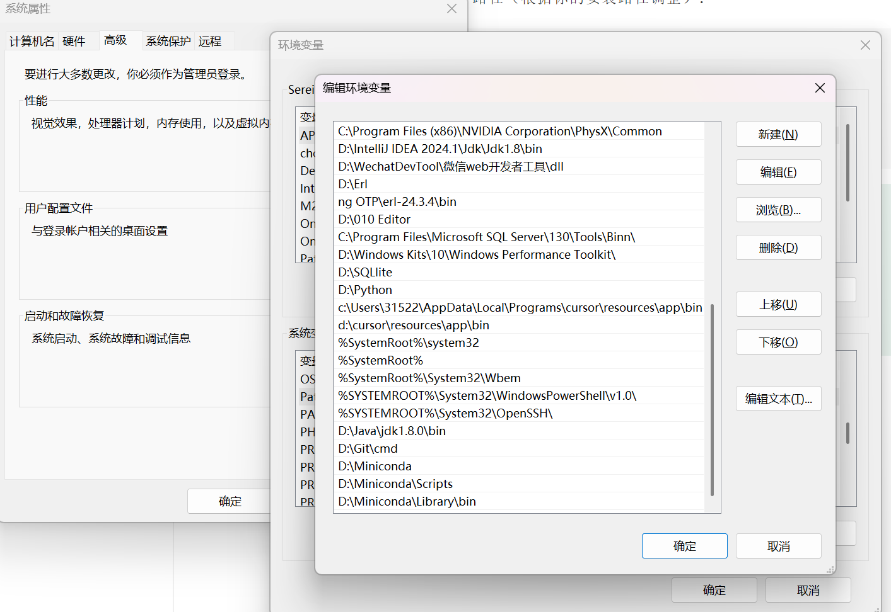
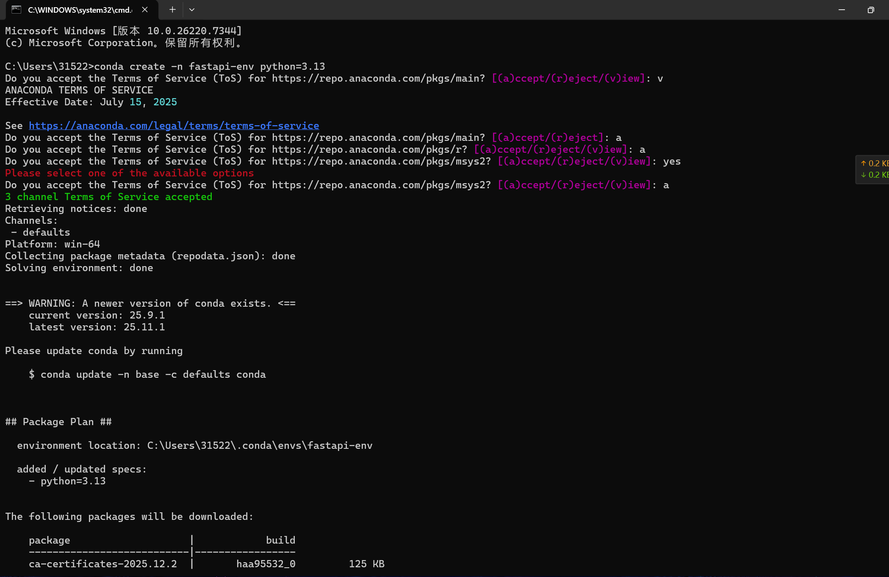
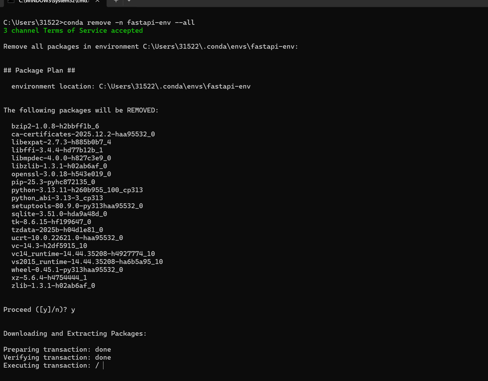
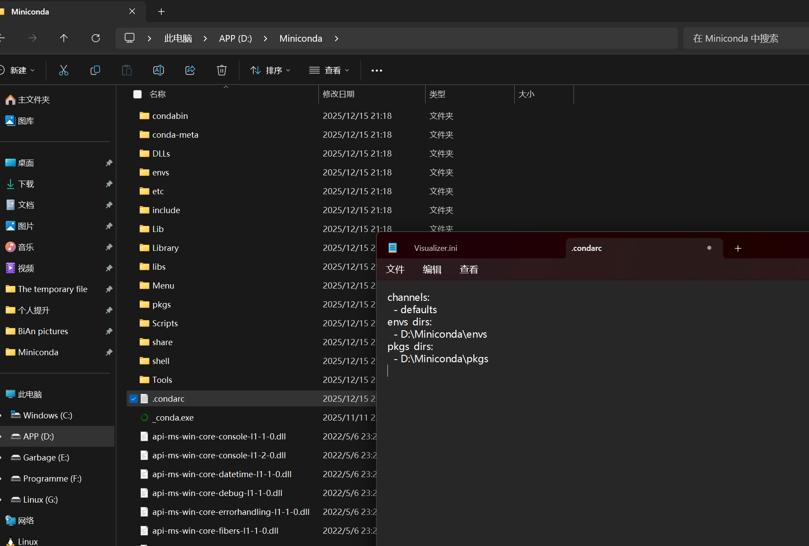
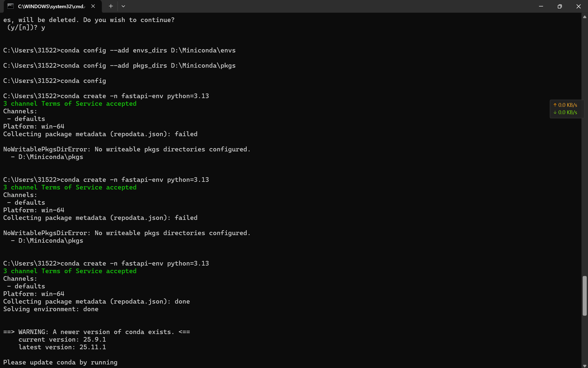
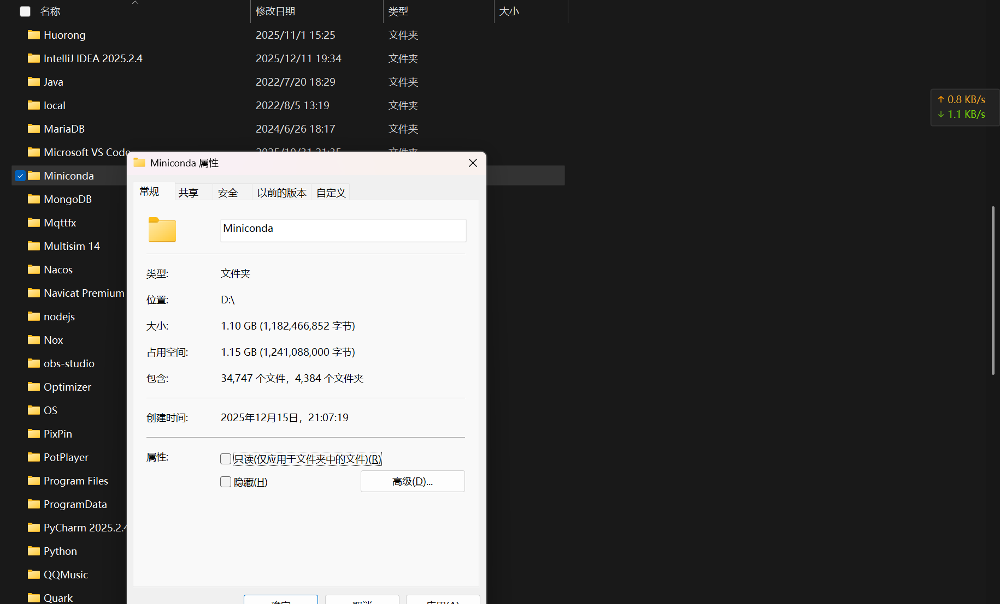
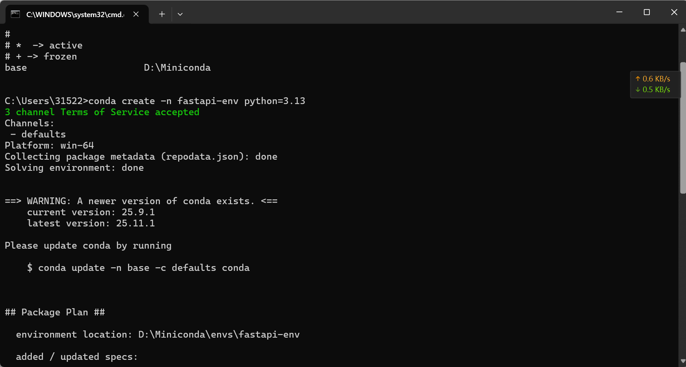
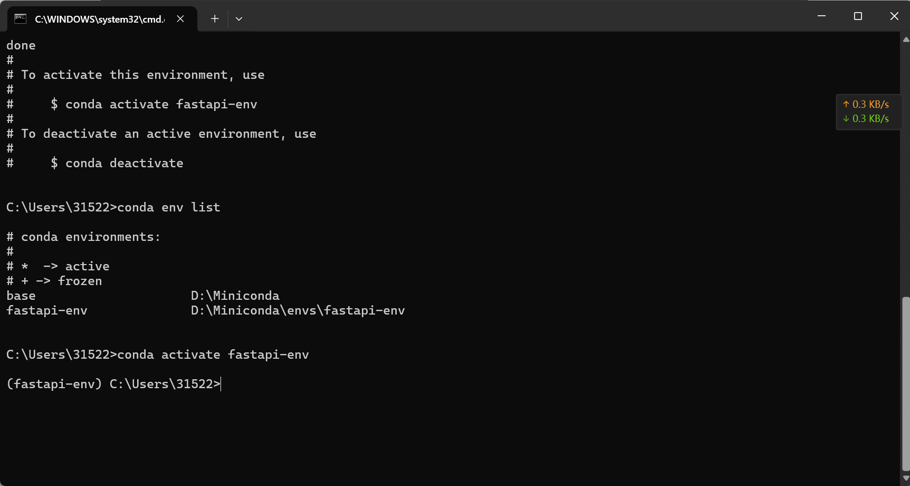

# Miniconda3 完整安装配置教程（2024-2025最新版）

## 一、认识 Miniconda

### 1.1 什么是 Miniconda？

Miniconda 是 Anaconda 的精简版本，专注于提供核心功能：

- **conda** - 强大的包和环境管理器
- **Python** - Python 解释器
- **pip** - Python 包管理工具
- 少量必要的基础依赖包

### 1.2 Miniconda vs Anaconda 对比

| 对比项     | Miniconda          | Anaconda               |
| ---------- | ------------------ | ---------------------- |
| 安装包大小 | ~50MB              | ~3GB+                  |
| 预装包数量 | 基础包（约10个）   | 250+ 科学计算包        |
| 安装速度   | 1-2分钟            | 10-20分钟              |
| 磁盘占用   | 约 400MB           | 约 5GB+                |
| 灵活性     | 按需安装，高度灵活 | 预装大量包，灵活性较低 |
| 适用场景   | 所有开发场景       | 数据科学入门学习       |

### 1.3 为什么选择 Miniconda？

**✅ 轻量高效** - 安装包小巧，安装迅速，节省磁盘空间

**✅ 按需定制** - 只安装必要的包，避免依赖冲突

**✅ 环境隔离** - 为不同项目创建独立环境，彻底解决版本冲突问题

**✅ 跨平台支持** - Windows、macOS、Linux 统一体验

**✅ 版本管理灵活** - 轻松管理 Python 3.8、3.9、3.10、3.11、3.12 等多个版本

**✅ 专业开发首选** - 更符合实际开发需求，便于长期维护

### 1.4 典型应用场景

```
项目A：Python 3.8 + TensorFlow 2.10
项目B：Python 3.11 + PyTorch 2.0
项目C：Python 3.9 + Django 4.2
```

使用 Miniconda，可以为每个项目创建独立环境，互不干扰！

------

## 二、下载 Miniconda3

### 2.1 官方下载地址

**推荐方式一：官方网站**

```
https://docs.anaconda.com/miniconda/
```

**推荐方式二：清华大学镜像（国内速度更快）**

```
https://mirrors.tuna.tsinghua.edu.cn/anaconda/miniconda/
```

**备选方式：北京外国语大学镜像**

```
https://mirrors.bfsu.edu.cn/anaconda/miniconda/
```

### 2.2 Windows 用户版本选择

推荐下载以下版本之一：

- **Miniconda3-latest-Windows-x86_64.exe**（最新版，Python 3.12）
- **Miniconda3-py311_24.11.1-0-Windows-x86_64.exe**（Python 3.11）
- **Miniconda3-py310_24.11.1-0-Windows-x86_64.exe**（Python 3.10）

> 💡 **提示**：截至 2024 年底，最新稳定版本是 **Miniconda3 24.11.1**，默认包含 Python 3.12。Python 3.9 即将停止支持，建议选择 Python 3.10 或更高版本。

------

## 三、安装 Miniconda3

### 3.1 启动安装程序

双击下载的 `.exe` 文件，点击 **Next** 开始安装。

### 3.2 接受许可协议

阅读许可协议后，点击 **I Agree** 继续。

### 3.3 选择安装类型

- **Just Me (recommended)** - 仅为当前用户安装（推荐）
- **All Users** - 为所有用户安装（需要管理员权限）

建议选择 **Just Me**，点击 **Next**。

### 3.4 选择安装路径（重要）

1. 点击 **Browse** 按钮
2. 选择或创建目录：`D:\Miniconda`
3. 确认路径符合规范
4. 点击 **Next**

> ⚠️ **路径要求**：
>
> - 不能包含中文字符
> - 不能包含空格（避免使用 `C:\Program Files`）
> - 推荐路径：`D:\Miniconda`、`C:\Miniconda3`、`D:\Dev\Miniconda`

### 3.5 高级选项配置

在 Advanced Options 页面：

**❌ 不要勾选：**

```
☐ Add Miniconda3 to my PATH environment variable
```

官方不推荐自动添加到 PATH，可能与其他软件冲突。我们将在后续手动配置。

**✅ 建议勾选：**

```
☑ Register Miniconda3 as my default Python 3.12
```

将 Miniconda 注册为系统默认的 Python 解释器。

点击 **Install** 开始安装。

### 3.6 完成安装

安装过程约 1-3 分钟，完成后依次点击 **Next** 和 **Finish**。

------

## 四、配置环境变量

安装完成后，需要手动配置环境变量，使 `conda` 命令在任何命令行中都可用。

### 4.1 打开环境变量设置

**方法一：通过搜索**

1. 按下 `Win` 键
2. 搜索"环境变量"
3. 点击 **编辑系统环境变量**
4. 点击 **环境变量** 按钮

**方法二：通过系统属性**

1. 右键点击 **此电脑** → **属性**
2. 点击 **高级系统设置**
3. 点击 **环境变量** 按钮

### 4.2 编辑 Path 变量

在"系统变量"区域找到 **Path**，双击打开。

### 4.3 添加 Miniconda 路径

点击 **新建**，依次添加以下三个路径（根据实际安装路径调整）：

```
D:\Miniconda
D:\Miniconda\Scripts
D:\Miniconda\Library\bin
```

> 💡 **路径说明**：
>
> - `D:\Miniconda` - 主程序目录，包含 Python 和 conda
> - `D:\Miniconda\Scripts` - 脚本目录，包含 conda、pip 等命令
> - `D:\Miniconda\Library\bin` - 库文件目录，包含依赖库的可执行文件



### 4.4 验证配置

1. 点击 **确定** 保存所有设置
2. **重新打开** 命令提示符（CMD）或 PowerShell
3. 执行验证命令：

```bash
conda --version
```

如果显示 `conda 24.11.1` 或类似版本号，说明配置成功！

```bash
python --version
```

应该显示 `Python 3.12.x` 或你安装的对应版本。

------

## 五、配置国内镜像源

为了提升包下载速度，强烈建议配置国内镜像源。

### 5.1 查看当前配置

```bash
conda config --show-sources
```

### 5.2 配置清华大学镜像源（推荐）

依次执行以下命令：

```bash
conda config --add channels https://mirrors.tuna.tsinghua.edu.cn/anaconda/pkgs/main
conda config --add channels https://mirrors.tuna.tsinghua.edu.cn/anaconda/pkgs/free
conda config --add channels https://mirrors.tuna.tsinghua.edu.cn/anaconda/pkgs/r
conda config --add channels https://mirrors.tuna.tsinghua.edu.cn/anaconda/pkgs/pro
conda config --add channels https://mirrors.tuna.tsinghua.edu.cn/anaconda/pkgs/msys2
```

设置显示镜像源地址：

```bash
conda config --set show_channel_urls yes
```

### 5.3 其他可用镜像源

**北京外国语大学镜像：**

```bash
conda config --add channels https://mirrors.bfsu.edu.cn/anaconda/pkgs/main
conda config --add channels https://mirrors.bfsu.edu.cn/anaconda/pkgs/free
```

**中科大镜像：**

```bash
conda config --add channels https://mirrors.ustc.edu.cn/anaconda/pkgs/main
conda config --add channels https://mirrors.ustc.edu.cn/anaconda/pkgs/free
```

### 5.4 配置 pip 镜像源

创建或编辑配置文件 `C:\Users\你的用户名\.pip\pip.ini`：

```ini
[global]
index-url = https://pypi.tuna.tsinghua.edu.cn/simple
trusted-host = pypi.tuna.tsinghua.edu.cn
```

或使用命令快速配置：

```bash
pip config set global.index-url https://pypi.tuna.tsinghua.edu.cn/simple
```

### 5.5 验证镜像配置

```bash
conda config --show channels
```

------

## 六、Conda 基础使用

### 6.1 创建虚拟环境

**创建指定 Python 版本的环境：**

```bash
conda create -n fast-env python=3.13
```



**创建环境并同时安装包：**

```bash
conda create -n fastapi_env python=3.13 fastapi uvicorn
```

### 6.2 激活和退出环境

**激活环境：**

```bash
conda activate fastapi_env
```

激活后，命令行前面会显示环境名称，如 `(fastapi_env)`。

**退出环境：**

```bash
conda deactivate
```

### 6.3 查看所有环境

```bash
conda env list
```

或

```bash
conda info --envs
```

### 6.4 删除环境

```bash
conda remove -n fastapi-env --all
```



### 6.5 安装和卸载包

**使用 conda 安装：**

```bash
conda install numpy pandas
```

**使用 pip 安装：**

```bash
pip install requests
```

**卸载包：**

```bash
conda remove numpy
```

或

```bash
pip uninstall requests
```

### 6.6 查看已安装的包

```bash
conda list
```

或

```bash
pip list
```

### 6.7 环境导出与导入

**导出环境配置：**

```bash
conda env export > environment.yml
```

**从配置文件创建环境：**

```bash
conda env create -f environment.yml
```

------

## 七、常见问题解决

### 7.1 PowerShell 无法激活环境

**问题描述：** 提示"无法加载文件...因为在此系统上禁止运行脚本"

**解决方案：**

1. 以管理员身份运行 PowerShell
2. 执行命令：

```powershell
Set-ExecutionPolicy -ExecutionPolicy RemoteSigned
```

1. 输入 `Y` 确认
2. 重启 PowerShell

### 7.2 conda 命令找不到

**解决方案：**

1. 检查环境变量配置是否正确（参考第四章）
2. 确认已添加三个必要路径到 Path
3. 重新打开命令行窗口
4. 如仍无法使用，执行：

```bash
D:\Miniconda\Scripts\conda.exe init
```

### 7.3 关闭自动激活 base 环境

默认情况下，打开终端会自动进入 base 环境。

**关闭自动激活：**

```bash
conda config --set auto_activate_base false
```

**重新开启：**

```bash
conda config --set auto_activate_base true
```

### 7.4 更新 conda

```bash
conda update conda
```

### 7.5 清理缓存

```bash
conda clean --all
```

### 7.6 修改默认存储路径

如果 C 盘空间不足，可以修改环境和包的存储路径。

**方法一：编辑配置文件**

找到配置文件 `D:\Miniconda\.condarc`（或 `C:\Users\你的用户名\.condarc`）：



添加以下内容：

```yaml
envs_dirs:
  - D:\Miniconda\envs
pkgs_dirs:
  - D:\Miniconda\pkgs
```

**方法二：使用命令行**

```bash
conda config --add envs_dirs D:\Miniconda\envs
conda config --add pkgs_dirs D:\Miniconda\pkgs
```



> ⚠️ **注意**：如果配置未生效，可能是权限问题。需要为安装目录添加写入权限，或取消只读属性。



------

## 八、实战案例：创建 FastAPI 开发环境

### 8.1 创建专用环境

```bash
conda create -n fastapi-env python=3.13
```



### 8.2 激活环境

```bash
conda activate fastapi_project
```



### 8.3 安装开发依赖

```bash
pip install fastapi uvicorn pydantic sqlalchemy
```

### 8.4 验证安装

```bash
python -c "import fastapi; print(fastapi.__version__)"
```

### 8.5 在 VS Code 中配置环境

1. 打开 VS Code
2. 按 `Ctrl + Shift + P`
3. 输入"Python: Select Interpreter"
4. 选择 `D:\Miniconda\envs\fastapi_project\python.exe`

------

## 九、常用命令速查表

| 功能           | 命令                                    |
| -------------- | --------------------------------------- |
| 查看版本       | `conda --version`                       |
| 更新 conda     | `conda update conda`                    |
| 创建环境       | `conda create -n 环境名 python=3.11`    |
| 激活环境       | `conda activate 环境名`                 |
| 退出环境       | `conda deactivate`                      |
| 查看所有环境   | `conda env list`                        |
| 删除环境       | `conda remove -n 环境名 --all`          |
| 安装包         | `conda install 包名`                    |
| 卸载包         | `conda remove 包名`                     |
| 查看已安装包   | `conda list`                            |
| 搜索包         | `conda search 包名`                     |
| 导出环境       | `conda env export > environment.yml`    |
| 从文件创建环境 | `conda env create -f environment.yml`   |
| 克隆环境       | `conda create -n 新环境 --clone 旧环境` |
| 清理缓存       | `conda clean --all`                     |
| 查看配置       | `conda config --show`                   |
| 添加镜像源     | `conda config --add channels 镜像地址`  |

------

## 十、最佳实践与总结

### 10.1 核心步骤回顾

1. ✅ 下载合适版本的 Miniconda3 安装包
2. ✅ 安装到规范路径（如 `D:\Miniconda`）
3. ✅ 手动配置环境变量（三个必要路径）
4. ✅ 配置国内镜像源加速下载
5. ✅ 为每个项目创建独立虚拟环境

### 10.2 开发最佳实践

- 🔹 **环境隔离**：每个项目使用独立的虚拟环境
- 🔹 **定期维护**：及时更新 conda 和包版本
- 🔹 **清理缓存**：定期清理不用的环境和缓存
- 🔹 **依赖管理**：使用 `environment.yml` 管理项目依赖
- 🔹 **安装优先级**：优先使用 conda 安装，其次考虑 pip

### 10.3 学习资源

- **Conda 官方文档**：https://docs.conda.io/
- **Miniconda 下载页面**：https://docs.anaconda.com/miniconda/
- **清华大学镜像站**：https://mirrors.tuna.tsinghua.edu.cn/help/anaconda/

------

通过 Miniconda，你可以高效管理多个 Python 环境，让开发工作更加规范和高效。现在就开始创建你的第一个虚拟环境，开启专业的 Python 开发之旅吧！🚀