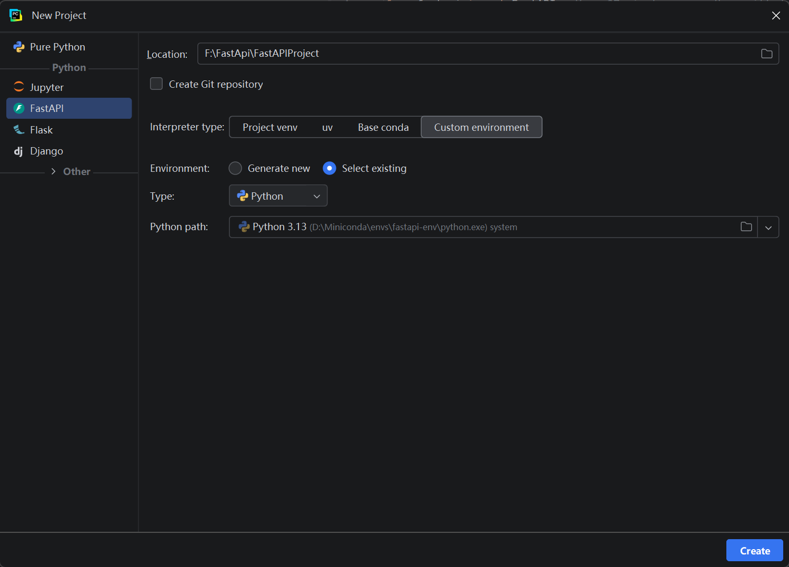
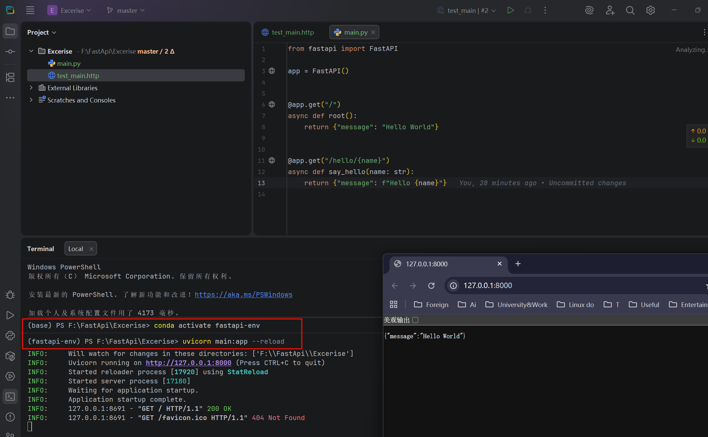
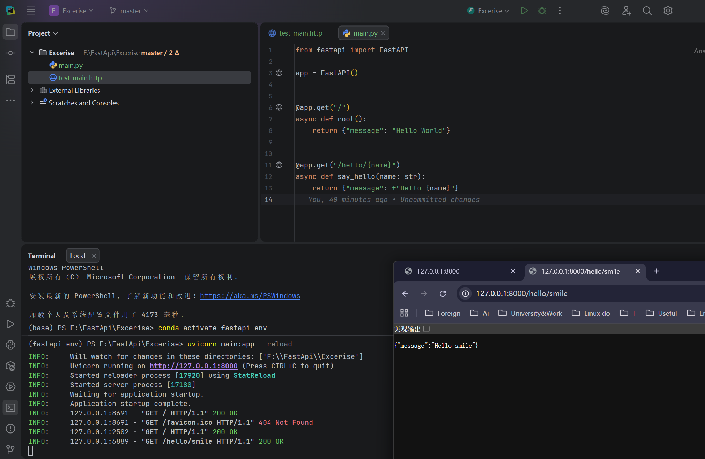
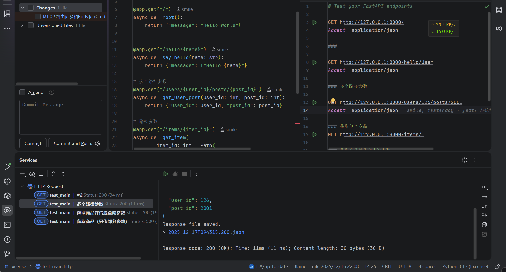

# FastAPI 路由传参与 Body 传参完整指南

## 前提：

在前面我们创建好了  fastapi-env   虚拟环境，创建项目的时候选择



运行现有demo，需要先去激活虚拟环境，如下：

然后再去运行项目：

```bash
conda activate fastapi-env
uvicorn main:app --reload
```





## 概述

FastAPI 提供了多种接收客户端数据的方式，主要包括：

- **路径参数 (Path Parameters)** - URL 路径中的参数
- **查询参数 (Query Parameters)** - URL 中 `?` 后面的参数
- **请求体 (Request Body)** - POST/PUT 等请求中的 JSON 数据
- **表单数据 (Form Data)** - 表单提交的数据
- **文件上传 (File Upload)** - 上传的文件
- **请求头 (Headers)** - HTTP 请求头
- **Cookie** - Cookie 数据

## 一、路径参数 (Path Parameters)

路径参数是 URL 路径的一部分，用于标识特定资源。

### 1.1 基础用法

```python
from fastapi import FastAPI

app = FastAPI()

@app.get("/users/{user_id}")
async def get_user(user_id: int):
    return {"user_id": user_id}

# 请求: GET /users/123
# 响应: {"user_id": 123}
```


### 1.2 多个路径参数

```python
@app.get("/users/{user_id}/posts/{post_id}")
async def get_user_post(user_id: int, post_id: int):
    return {"user_id": user_id, "post_id": post_id}

# 请求: GET /users/5/posts/100
# 响应: {"user_id": 5, "post_id": 100}
```



### 1.3 路径参数验证

```python
from fastapi import Path

@app.get("/items/{item_id}")
async def get_item(
    item_id: int = Path(
        ...,  # ... 表示必填
        title="商品ID",
        description="要查询的商品ID",
        ge=1,  # 大于等于1
        le=1000  # 小于等于1000
    )
):
    return {"item_id": item_id}
```


### 1.4 字符串路径参数

```python
@app.get("/files/{file_path:path}")
async def get_file(file_path: str):
    # :path 表示可以包含斜杠
    return {"file_path": file_path}

# 请求: GET /files/documents/2024/report.pdf
# file_path = "documents/2024/report.pdf"
```

## 二、查询参数 (Query Parameters)

查询参数在 URL 的 `?` 后面，用于过滤、排序、分页等。

### 2.1 基础用法

```python
@app.get("/products")
async def list_products(skip: int = 0, limit: int = 10):
    return {"skip": skip, "limit": limit}

# 请求: GET /products?skip=20&limit=5
# 响应: {"skip": 20, "limit": 5}
```


### 2.2 可选查询参数

```python
@app.get("/search")
async def search_items(
    keyword: str,  # 必填
    category: str | None = None,  # 可选
    min_price: float | None = None,  # 可选
    max_price: float | None = None   # 可选
):
    result = {"keyword": keyword}
    if category:
        result["category"] = category
    if min_price:
        result["min_price"] = min_price
    if max_price:
        result["max_price"] = max_price
    return result

# 请求: GET /search?keyword=手机&category=电子产品&min_price=1000
```

### 2.3 查询参数验证

```python
from fastapi import Query

@app.get("/items")
async def list_items(
    q: str | None = Query(
        None,
        min_length=3,
        max_length=50,
        pattern="^[a-zA-Z0-9_]+$",
        title="搜索关键词",
        description="用于搜索商品的关键词"
    ),
    page: int = Query(1, ge=1, description="页码"),
    size: int = Query(10, ge=1, le=100, description="每页数量")
):
    return {"q": q, "page": page, "size": size}
```

### 2.4 查询参数列表

```python
@app.get("/items/filter")
async def filter_items(
    tags: list[str] = Query([])
):
    return {"tags": tags}

# 请求: GET /items/filter?tags=electronics&tags=sale&tags=new
# 响应: {"tags": ["electronics", "sale", "new"]}
```

## 三、请求体参数 (Request Body)

请求体通常用于 POST、PUT、PATCH 等请求，传递复杂的 JSON 数据。

具体的Field()数据验证  的使用语法 --->   [Pydantic介绍](./01.Pydantic介绍.md)

### 3.1 单个请求体

```python
from pydantic import BaseModel, Field

class Item(BaseModel):
    name: str = Field(..., min_length=1, max_length=100)
    description: str | None = Field(None, max_length=500)
    price: float = Field(..., gt=0)
    quantity: int = Field(default=1, ge=1)
    tags: list[str] = []

@app.post("/items")
async def create_item(item: Item):
    return {"message": "商品创建成功", "item": item}

# 请求体:
# {
#   "name": "笔记本电脑",
#   "description": "高性能办公本",
#   "price": 5999.99,
#   "quantity": 10,
#   "tags": ["电子产品", "办公"]
# }
```

### 3.2 多个请求体参数

```python
class User(BaseModel):
    username: str
    email: str

class Item(BaseModel):
    name: str
    price: float

@app.post("/orders")
async def create_order(user: User, item: Item):
    return {"user": user, "item": item}

# 请求体:
# {
#   "user": {
#     "username": "zhangsan",
#     "email": "zhangsan@example.com"
#   },
#   "item": {
#     "name": "鼠标",
#     "price": 99.99
#   }
# }
```

### 3.3 嵌套模型

```python
class Image(BaseModel):
    url: str
    name: str

class Product(BaseModel):
    name: str
    price: float
    images: list[Image]
    metadata: dict[str, str | int]

@app.post("/products")
async def create_product(product: Product):
    return product

# 请求体:
# {
#   "name": "智能手表",
#   "price": 1999.99,
#   "images": [
#     {"url": "https://example.com/1.jpg", "name": "正面"},
#     {"url": "https://example.com/2.jpg", "name": "侧面"}
#   ],
#   "metadata": {
#     "brand": "Apple",
#     "model": "Series 9",
#     "year": 2024
#   }
# }
```

### 3.4 使用 Body 添加额外配置

```python
from fastapi import Body

@app.put("/items/{item_id}")
async def update_item(
    item_id: int,
    item: Item,
    importance: int = Body(..., ge=1, le=5)  # 单个字段作为 body
):
    return {"item_id": item_id, "item": item, "importance": importance}

# 请求体:
# {
#   "item": {
#     "name": "更新的商品",
#     "price": 299.99
#   },
#   "importance": 4
# }
```

## 四、混合使用参数

### 4.1 路径参数 + 查询参数 + 请求体

```python
@app.put("/users/{user_id}/items/{item_id}")
async def update_user_item(
    user_id: int = Path(..., ge=1),
    item_id: int = Path(..., ge=1),
    item: Item = Body(...),
    q: str | None = Query(None)
):
    result = {
        "user_id": user_id,
        "item_id": item_id,
        "item": item
    }
    if q:
        result["q"] = q
    return result

# 请求: PUT /users/5/items/10?q=special
# 请求体: {"name": "商品名", "price": 99.99}
```

### 4.2 完整的 CRUD 示例

```python
from typing import List

# 模拟数据库
fake_db: dict[int, Item] = {}

# 创建
@app.post("/items", status_code=201)
async def create_item(item: Item):
    item_id = len(fake_db) + 1
    fake_db[item_id] = item
    return {"id": item_id, "item": item}

# 读取列表
@app.get("/items")
async def list_items(
    skip: int = Query(0, ge=0),
    limit: int = Query(10, ge=1, le=100)
):
    items = list(fake_db.items())[skip:skip + limit]
    return {"total": len(fake_db), "items": items}

# 读取单个
@app.get("/items/{item_id}")
async def get_item(item_id: int = Path(..., ge=1)):
    if item_id not in fake_db:
        return {"error": "商品不存在"}
    return {"id": item_id, "item": fake_db[item_id]}

# 更新
@app.put("/items/{item_id}")
async def update_item(
    item_id: int = Path(..., ge=1),
    item: Item = Body(...)
):
    if item_id not in fake_db:
        return {"error": "商品不存在"}
    fake_db[item_id] = item
    return {"id": item_id, "item": item}

# 删除
@app.delete("/items/{item_id}")
async def delete_item(item_id: int = Path(..., ge=1)):
    if item_id not in fake_db:
        return {"error": "商品不存在"}
    deleted_item = fake_db.pop(item_id)
    return {"message": "删除成功", "item": deleted_item}
```

## 五、表单数据和文件上传

### 5.1 表单数据

```python
from fastapi import Form

@app.post("/login")
async def login(
    username: str = Form(...),
    password: str = Form(...)
):
    return {"username": username}
```

### 5.2 文件上传

```python
from fastapi import File, UploadFile

@app.post("/upload")
async def upload_file(file: UploadFile = File(...)):
    return {
        "filename": file.filename,
        "content_type": file.content_type,
        "size": len(await file.read())
    }
```

## 六、请求头和 Cookie

### 6.1 请求头

```python
from fastapi import Header

@app.get("/headers")
async def read_headers(
    user_agent: str | None = Header(None),
    x_token: str | None = Header(None)
):
    return {"user_agent": user_agent, "x_token": x_token}
```

### 6.2 Cookie

```python
from fastapi import Cookie

@app.get("/cookies")
async def read_cookies(
    session_id: str | None = Cookie(None)
):
    return {"session_id": session_id}
```

## 参数类型对比

| 参数类型 | 位置          | 适用场景            | 数据类型       |
| -------- | ------------- | ------------------- | -------------- |
| Path     | URL路径       | 资源标识            | 简单类型       |
| Query    | URL查询字符串 | 过滤、排序、分页    | 简单类型、列表 |
| Body     | 请求体        | 复杂数据、创建/更新 | 复杂对象       |
| Form     | 表单          | 表单提交            | 简单类型       |
| File     | 表单          | 文件上传            | 文件           |
| Header   | 请求头        | 认证、元数据        | 字符串         |
| Cookie   | Cookie        | 会话管理            | 字符串         |

## 总结

1. **路径参数**适合资源标识（如 ID）
2. **查询参数**适合可选的过滤和配置
3. **请求体**适合传递复杂的结构化数据
4. FastAPI 会自动进行**类型验证和转换**
5. 使用 `Path`、`Query`、`Body` 可以添加更多**验证规则**
6. 结合 Pydantic 模型可以构建**类型安全**的 API

掌握这些传参方式，你就能构建出灵活且健壮的 RESTful API 了！