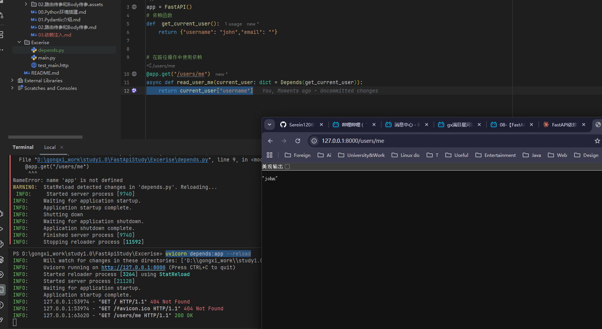
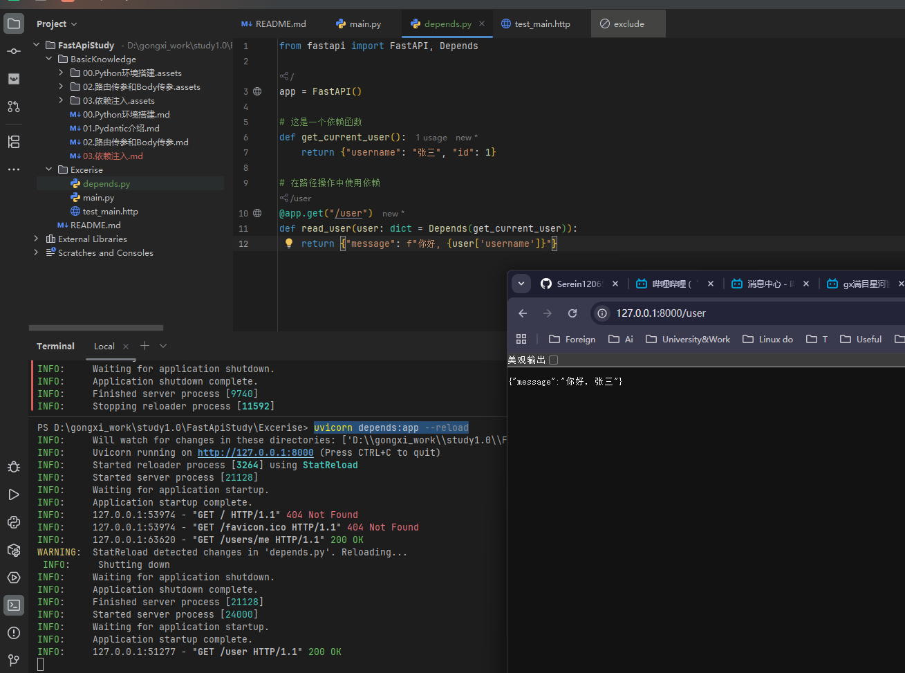
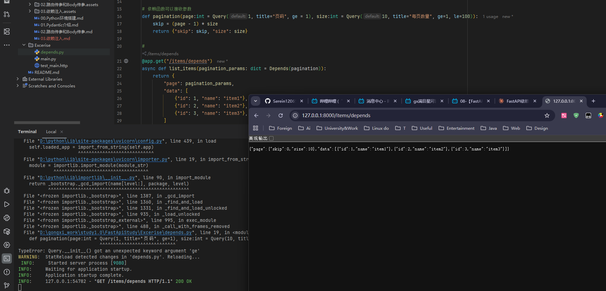
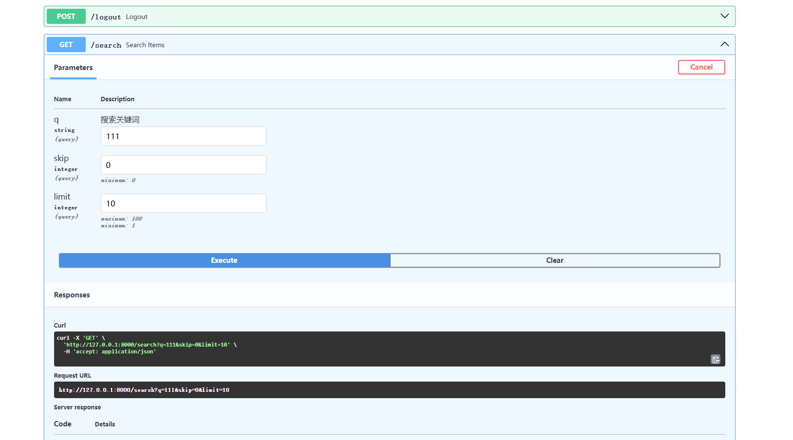

# FastAPI 依赖注入完全指南

## 说明

由于这是在别环境创建的文件，导致了基本的虚拟环境是没有配置的，也就是没有安装Miniconda3

而此时虽然配置了相应的解释器，但是由于没有配置uvicorn 然后直接运行是跑不起来的，因此，如果难得安装Miniconda3  只想在本地学习的话，就先去安装uvicorn

```bash
pip install fastapi uvicorn
```

然后再运行就行了

```bash
uvicorn depends:app --reload
```



## 什么是依赖注入?

依赖注入(Dependency Injection, DI)是一种**设计模式**,简单来说就是:当一个函数需要使用某些资源或数据时,不是在函数内部直接创建,而是由外部"注入"进来。

**举个生活例子:**

- ❌ 不好的方式:你每次做饭都要自己去菜市场买菜、回来洗菜
- ✅ 好的方式:有人帮你把洗好的菜直接送到厨房,你只需要做饭

在 FastAPI 中,依赖注入帮助我们:

- 复用代码(比如数据库连接、用户认证)
- 代码更清晰易读
- 方便测试和维护

------

## 基础概念:第一个依赖注入

### 最简单的例子

```python
from fastapi import FastAPI, Depends

app = FastAPI()

# 这是一个依赖函数
def get_current_user():
    return {"username": "张三", "id": 1}

# 在路径操作中使用依赖
@app.get("/user")
def read_user(user: dict = Depends(get_current_user)):
    return {"message": f"你好, {user['username']}"}
```

**解释:**

1. `get_current_user()` 是一个普通的 Python 函数,我们称它为"依赖函数"
2. `Depends(get_current_user)` 告诉 FastAPI:"请先执行 `get_current_user`,然后把结果传给 `user` 参数"
3. 当访问 `/user` 时,FastAPI 会自动调用 `get_current_user()`,然后把返回值传递给 `read_user` 函数



------

## 带参数的依赖

依赖函数也可以有自己的参数:

```python
from fastapi import FastAPI, Depends, Query

app = FastAPI()

# 依赖函数可以接收参数
def pagination(page: int = Query(1, ge=1), size: int = Query(10, ge=1, le=100)):
    skip = (page - 1) * size
    return {"skip": skip, "limit": size}

@app.get("/items")
def get_items(pagination_params: dict = Depends(pagination)):
    # 模拟从数据库获取数据
    return {
        "page": pagination_params,
        "data": ["商品1", "商品2", "商品3"]
    }
```

**访问示例:**

- `GET /items?page=2&size=20`
- FastAPI 会自动从查询参数中提取 `page` 和 `size`,传给 `pagination` 函数



------

## 嵌套依赖:依赖中还有依赖

依赖可以相互依赖,形成链式结构:

```python
from fastapi import FastAPI, Depends, Header, HTTPException

app = FastAPI()

# 第一层依赖:获取token
def get_token(authorization: str = Header(...)):
    if not authorization.startswith("Bearer "):
        raise HTTPException(status_code=401, detail="无效的认证格式")
    return authorization[7:]  # 去掉 "Bearer " 前缀

# 第二层依赖:验证用户(依赖于 get_token)
def get_current_user(token: str = Depends(get_token)):
    # 模拟验证token
    if token != "secret123":
        raise HTTPException(status_code=401, detail="无效的token")
    return {"username": "李四", "id": 2}

# 第三层:检查是否是管理员(依赖于 get_current_user)
def get_admin_user(user: dict = Depends(get_current_user)):
    if user["id"] != 2:  # 假设只有id=2的是管理员
        raise HTTPException(status_code=403, detail="权限不足")
    return user

# 在路径操作中使用
@app.get("/admin/dashboard")
def admin_dashboard(admin: dict = Depends(get_admin_user)):
    return {"message": f"欢迎管理员 {admin['username']}"}
```

**执行流程:**

1. FastAPI 先调用 `get_token()`,从请求头获取 token
2. 然后调用 `get_current_user(token)`,验证用户身份
3. 最后调用 `get_admin_user(user)`,检查管理员权限
4. 如果全部通过,才执行 `admin_dashboard()`

------

## 使用类作为依赖

除了函数,我们还可以使用类作为依赖:

```python
from fastapi import FastAPI, Depends, Query

app = FastAPI()

# 类依赖
class CommonQueryParams:
    def __init__(
        self, 
        q: str = Query(None, description="搜索关键词"),
        skip: int = Query(0, ge=0),
        limit: int = Query(10, ge=1, le=100)
    ):
        self.q = q
        self.skip = skip
        self.limit = limit

@app.get("/search")
def search_items(commons: CommonQueryParams = Depends()):
    response = {
        "query": commons.q,
        "skip": commons.skip,
        "limit": commons.limit
    }
    return response
```

**注意:** `Depends()` 不带参数时,FastAPI 会自动识别参数类型(这里是 `CommonQueryParams`)




------

## 实战案例:数据库连接

这是依赖注入最常用的场景之一:

```python
from fastapi import FastAPI, Depends
from typing import Generator

app = FastAPI()

# 模拟数据库类
class FakeDatabase:
    def __init__(self):
        self.connection = "数据库连接已建立"
    
    def get_user(self, user_id: int):
        return {"id": user_id, "name": f"用户{user_id}"}
    
    def close(self):
        print("数据库连接已关闭")

# 数据库依赖(使用生成器,自动清理资源)
def get_db() -> Generator:
    db = FakeDatabase()
    try:
        yield db  # 返回数据库实例
    finally:
        db.close()  # 请求结束后自动执行清理

# 使用数据库依赖
@app.get("/users/{user_id}")
def read_user(user_id: int, db: FakeDatabase = Depends(get_db)):
    user = db.get_user(user_id)
    return user
```

**工作原理:**

1. 请求到来时,FastAPI 执行 `get_db()`,创建数据库连接
2. `yield db` 把数据库实例传给路径操作函数
3. 路径操作函数执行完毕后,FastAPI 执行 `finally` 块中的清理代码

------

## 全局依赖:对所有路由生效

如果某个依赖需要应用到所有路由,可以在创建 `FastAPI` 实例时指定:

```python
from fastapi import FastAPI, Depends, HTTPException, Header

# 全局依赖:检查API密钥
def verify_api_key(x_api_key: str = Header(...)):
    if x_api_key != "my-secret-key":
        raise HTTPException(status_code=403, detail="无效的API密钥")
    return x_api_key

# 将依赖应用到整个应用
app = FastAPI(dependencies=[Depends(verify_api_key)])

@app.get("/public")
def public_endpoint():
    return {"message": "这个接口也需要API密钥"}

@app.get("/private")
def private_endpoint():
    return {"message": "私有数据"}
```

**注意:** 所有路由都会先执行 `verify_api_key` 检查

------

## 路由级别的依赖

也可以只对某些路由组应用依赖:

```python
from fastapi import FastAPI, APIRouter, Depends

app = FastAPI()

def admin_required():
    # 模拟管理员检查
    return {"role": "admin"}

# 创建路由组,指定依赖
admin_router = APIRouter(
    prefix="/admin",
    dependencies=[Depends(admin_required)]  # 这个路由组下的所有路由都需要管理员权限
)

@admin_router.get("/users")
def list_users():
    return {"users": ["用户1", "用户2"]}

@admin_router.delete("/users/{user_id}")
def delete_user(user_id: int):
    return {"message": f"删除用户 {user_id}"}

app.include_router(admin_router)
```

------

## 依赖的缓存机制

在同一个请求中,相同的依赖默认只会执行一次:

```python
from fastapi import FastAPI, Depends

app = FastAPI()

call_count = 0

def expensive_operation():
    global call_count
    call_count += 1
    print(f"执行了 {call_count} 次")
    return {"result": "expensive data"}

@app.get("/test")
def test_endpoint(
    dep1: dict = Depends(expensive_operation),
    dep2: dict = Depends(expensive_operation)  # 不会重复执行
):
    return {"dep1": dep1, "dep2": dep2, "call_count": call_count}
```

**如果需要每次都执行,可以设置 `use_cache=False`:**

```python
@app.get("/test-no-cache")
def test_endpoint(
    dep1: dict = Depends(expensive_operation),
    dep2: dict = Depends(expensive_operation, use_cache=False)  # 会执行两次
):
    return {"dep1": dep1, "dep2": dep2}
```

------

## 实战:完整的用户认证系统

综合运用依赖注入实现一个真实的认证系统:

```python
from fastapi import FastAPI, Depends, HTTPException, status
from fastapi.security import HTTPBearer, HTTPAuthorizationCredentials
from typing import Optional

app = FastAPI()
security = HTTPBearer()

# 模拟用户数据库
fake_users_db = {
    "token123": {"username": "张三", "role": "user"},
    "admintoken": {"username": "管理员", "role": "admin"}
}

# 依赖1: 获取token
def get_token(credentials: HTTPAuthorizationCredentials = Depends(security)):
    return credentials.credentials

# 依赖2: 验证用户
def get_current_user(token: str = Depends(get_token)):
    user = fake_users_db.get(token)
    if not user:
        raise HTTPException(
            status_code=status.HTTP_401_UNAUTHORIZED,
            detail="认证失败"
        )
    return user

# 依赖3: 验证管理员
def get_admin_user(user: dict = Depends(get_current_user)):
    if user["role"] != "admin":
        raise HTTPException(
            status_code=status.HTTP_403_FORBIDDEN,
            detail="需要管理员权限"
        )
    return user

# 公开接口
@app.get("/")
def public_route():
    return {"message": "这是公开接口"}

# 需要登录的接口
@app.get("/profile")
def get_profile(user: dict = Depends(get_current_user)):
    return {"profile": user}

# 需要管理员权限的接口
@app.delete("/users/{user_id}")
def delete_user(user_id: int, admin: dict = Depends(get_admin_user)):
    return {"message": f"管理员 {admin['username']} 删除了用户 {user_id}"}
```

**测试方法:**

```bash
# 需要在请求头中添加: Authorization: Bearer token123
# 或使用 Swagger UI (访问 http://localhost:8000/docs)
```

------

## 常见应用场景总结

| 场景       | 说明                     | 示例                                   |
| ---------- | ------------------------ | -------------------------------------- |
| 数据库连接 | 为每个请求提供数据库会话 | `db: Session = Depends(get_db)`        |
| 用户认证   | 验证用户身份             | `user = Depends(get_current_user)`     |
| 分页参数   | 复用分页逻辑             | `pagination = Depends(get_pagination)` |
| 配置注入   | 注入应用配置             | `config = Depends(get_settings)`       |
| 权限检查   | 验证用户权限             | `admin = Depends(require_admin)`       |
| 日志记录   | 自动记录请求日志         | `logger = Depends(get_logger)`         |

------

## 最佳实践建议

1. **保持依赖函数简单**: 每个依赖函数只做一件事
2. **使用类型注解**: 帮助 IDE 提供代码补全
3. **合理使用嵌套**: 不要嵌套太深,一般 2-3 层就够了
4. **注意性能**: 耗时操作考虑使用缓存
5. **错误处理**: 在依赖中抛出 `HTTPException` 来处理错误

------

## 学习路径建议

1. ✅ 先掌握简单的函数依赖
2. ✅ 学习带参数的依赖
3. ✅ 理解嵌套依赖的执行顺序
4. ✅ 实践数据库连接等真实场景
5. ✅ 构建完整的认证授权系统

**继续学习资源:**

- FastAPI 官方文档: https://fastapi.tiangolo.com/zh/
- 练习项目: 尝试构建一个完整的 TODO API,使用依赖注入管理数据库和用户认证

------

## 练习题

自己动手试试:

1. 创建一个依赖函数,从请求头中获取 `User-Agent`
2. 实现一个速率限制依赖,限制每个 IP 每分钟只能请求 10 次
3. 构建一个多租户系统,使用依赖注入识别不同租户

加油!依赖注入是 FastAPI 的核心特性,掌握它你就能写出优雅、可维护的代码! 🚀