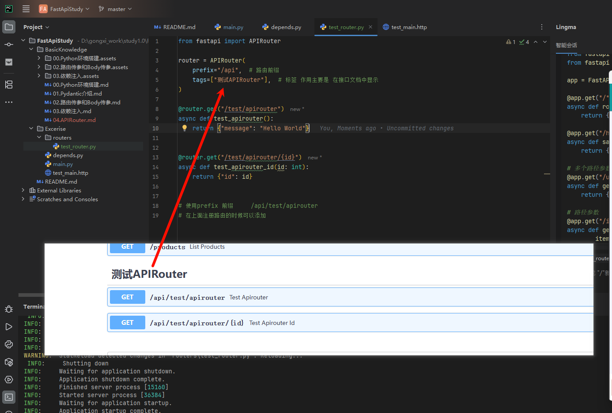

# FastAPI APIRouter 学习笔记

## 一、什么是 APIRouter?

APIRouter 是 FastAPI 提供的一个用于组织和管理路由的工具。当项目变大时,把所有路由都写在一个文件里会很混乱,APIRouter 可以帮助我们将路由分组管理,让代码更清晰、更易维护。

### 1.1 为什么需要 APIRouter?

**问题场景:**

```python
# main.py - 所有路由都挤在一起,很难维护
from fastapi import FastAPI

app = FastAPI()

@app.get("/users")
def get_users():
    return {"users": []}

@app.post("/users")
def create_user():
    return {"message": "User created"}

@app.get("/products")
def get_products():
    return {"products": []}

@app.post("/products")
def create_product():
    return {"message": "Product created"}

# ... 几十个路由混在一起
```

**使用 APIRouter 的优势:**

- 将相关的路由分组到不同的文件中
- 代码结构更清晰,易于维护
- 团队协作更方便,不同人负责不同模块
- 可以为一组路由设置统一的前缀、标签等

## 二、基础用法

### 2.1 创建第一个 Router

**项目结构:**

```
my_project/
├── main.py
└── routers/
    └── users.py
```

**步骤 1: 创建 router 文件 (routers/users.py)**

```python
from fastapi import APIRouter

# 创建一个 APIRouter 实例
router = APIRouter()

@router.get("/users")
def get_users():
    """获取所有用户"""
    return {
        "users": [
            {"id": 1, "name": "张三"},
            {"id": 2, "name": "李四"}
        ]
    }

@router.get("/users/{user_id}")
def get_user(user_id: int):
    """获取单个用户"""
    return {"id": user_id, "name": "张三"}

@router.post("/users")
def create_user(name: str):
    """创建新用户"""
    return {"message": f"用户 {name} 创建成功"}
```

**步骤 2: 在主文件中引入 router (main.py)**

```python
from fastapi import FastAPI
from routers import users

app = FastAPI()

# 将 users router 包含进来
app.include_router(users.router)

@app.get("/")
def root():
    return {"message": "欢迎使用 API"}
```

**测试:**

- 访问 `http://localhost:8000/users` - 获取所有用户
- 访问 `http://localhost:8000/users/1` - 获取 ID 为 1 的用户

### 2.2 添加路由前缀

使用 `prefix` 参数可以为所有路由添加统一前缀,避免重复写路径。

```python
# routers/users.py
from fastapi import APIRouter

router = APIRouter(
    prefix="/users",  # 统一前缀
    tags=["用户管理"]  # 在文档中显示的标签
)

# 注意:现在路由路径不需要再写 /users 了
@router.get("/")  # 实际路径: /users/
def get_users():
    return {"users": ["张三", "李四"]}

@router.get("/{user_id}")  # 实际路径: /users/{user_id}
def get_user(user_id: int):
    return {"id": user_id, "name": "张三"}

@router.post("/")  # 实际路径: /users/
def create_user(name: str):
    return {"message": f"用户 {name} 创建成功"}
# main.py
from fastapi import FastAPI
from routers import users

app = FastAPI()

# 直接包含,不需要再指定前缀
app.include_router(users.router)
```



**<font color=red>参考两个开源的项目，发现他们使用的router都是类似 Java SpringBoot 项目那样有Controller 层  也就是创建 Controller 将路由封装到里面的 </font>**


参考的开源项目：

[Banana - sliders](https://github.com/Serein120658/banana-slides) 

[xiaomi-miloco](https://github.com/XiaoMi/xiaomi-miloco.git )

## 三、实战案例:构建一个完整的应用

### 3.1 项目结构

```
my_shop/
├── main.py
├── routers/
│   ├── __init__.py
│   ├── users.py
│   ├── products.py
│   └── orders.py
└── models.py
```

### 3.2 定义数据模型 (models.py)

```python
from pydantic import BaseModel
from typing import Optional

class User(BaseModel):
    id: Optional[int] = None
    name: str
    email: str
    age: int

class Product(BaseModel):
    id: Optional[int] = None
    name: str
    price: float
    stock: int

class Order(BaseModel):
    id: Optional[int] = None
    user_id: int
    product_id: int
    quantity: int
```

### 3.3 用户路由 (routers/users.py)

```python
from fastapi import APIRouter, HTTPException
from models import User

router = APIRouter(
    prefix="/api/users",
    tags=["用户管理"],
)

# 模拟数据库
fake_users_db = [
    {"id": 1, "name": "张三", "email": "zhang@example.com", "age": 25},
    {"id": 2, "name": "李四", "email": "li@example.com", "age": 30},
]

@router.get("/", response_model=list[User])
def get_all_users():
    """获取所有用户"""
    return fake_users_db

@router.get("/{user_id}", response_model=User)
def get_user(user_id: int):
    """根据 ID 获取用户"""
    for user in fake_users_db:
        if user["id"] == user_id:
            return user
    raise HTTPException(status_code=404, detail="用户不存在")

@router.post("/", response_model=User)
def create_user(user: User):
    """创建新用户"""
    user.id = len(fake_users_db) + 1
    fake_users_db.append(user.dict())
    return user

@router.put("/{user_id}", response_model=User)
def update_user(user_id: int, user: User):
    """更新用户信息"""
    for i, u in enumerate(fake_users_db):
        if u["id"] == user_id:
            user.id = user_id
            fake_users_db[i] = user.dict()
            return user
    raise HTTPException(status_code=404, detail="用户不存在")

@router.delete("/{user_id}")
def delete_user(user_id: int):
    """删除用户"""
    for i, u in enumerate(fake_users_db):
        if u["id"] == user_id:
            fake_users_db.pop(i)
            return {"message": "删除成功"}
    raise HTTPException(status_code=404, detail="用户不存在")
```

### 3.4 商品路由 (routers/products.py)

```python
from fastapi import APIRouter, HTTPException
from models import Product

router = APIRouter(
    prefix="/api/products",
    tags=["商品管理"],
)

fake_products_db = [
    {"id": 1, "name": "iPhone 15", "price": 5999.0, "stock": 50},
    {"id": 2, "name": "MacBook Pro", "price": 12999.0, "stock": 30},
]

@router.get("/", response_model=list[Product])
def get_all_products():
    """获取所有商品"""
    return fake_products_db

@router.get("/{product_id}", response_model=Product)
def get_product(product_id: int):
    """根据 ID 获取商品"""
    for product in fake_products_db:
        if product["id"] == product_id:
            return product
    raise HTTPException(status_code=404, detail="商品不存在")

@router.post("/", response_model=Product)
def create_product(product: Product):
    """添加新商品"""
    product.id = len(fake_products_db) + 1
    fake_products_db.append(product.dict())
    return product

@router.patch("/{product_id}/stock")
def update_stock(product_id: int, quantity: int):
    """更新库存"""
    for product in fake_products_db:
        if product["id"] == product_id:
            product["stock"] += quantity
            return {"message": "库存更新成功", "new_stock": product["stock"]}
    raise HTTPException(status_code=404, detail="商品不存在")
```

### 3.5 订单路由 (routers/orders.py)

```python
from fastapi import APIRouter, HTTPException
from models import Order

router = APIRouter(
    prefix="/api/orders",
    tags=["订单管理"],
)

fake_orders_db = []

@router.get("/", response_model=list[Order])
def get_all_orders():
    """获取所有订单"""
    return fake_orders_db

@router.post("/", response_model=Order)
def create_order(order: Order):
    """创建新订单"""
    order.id = len(fake_orders_db) + 1
    fake_orders_db.append(order.dict())
    return order

@router.get("/user/{user_id}", response_model=list[Order])
def get_user_orders(user_id: int):
    """获取某个用户的所有订单"""
    user_orders = [o for o in fake_orders_db if o["user_id"] == user_id]
    return user_orders
```

### 3.6 主文件 (main.py)

```python
from fastapi import FastAPI
from routers import users, products, orders

app = FastAPI(
    title="我的商城 API",
    description="一个使用 APIRouter 构建的示例应用",
    version="1.0.0"
)

# 包含所有路由
app.include_router(users.router)
app.include_router(products.router)
app.include_router(orders.router)

@app.get("/")
def root():
    return {
        "message": "欢迎使用商城 API",
        "docs": "/docs",
        "endpoints": {
            "users": "/api/users",
            "products": "/api/products",
            "orders": "/api/orders"
        }
    }

# 运行命令: uvicorn main:app --reload
```

## 四、高级特性

### 4.1 路由依赖注入

可以为整个 router 添加依赖,所有路由都会使用这个依赖。

```python
from fastapi import APIRouter, Depends, HTTPException, Header

def verify_token(x_token: str = Header(...)):
    """验证 token"""
    if x_token != "secret-token":
        raise HTTPException(status_code=403, detail="无效的 token")
    return x_token

router = APIRouter(
    prefix="/api/admin",
    tags=["管理员"],
    dependencies=[Depends(verify_token)]  # 所有路由都需要验证
)

@router.get("/dashboard")
def admin_dashboard():
    """只有携带正确 token 才能访问"""
    return {"message": "欢迎来到管理后台"}
```

### 4.2 路由响应模型

```python
from fastapi import APIRouter
from pydantic import BaseModel

class UserOut(BaseModel):
    """不包含密码的用户模型"""
    id: int
    name: str
    email: str

router = APIRouter()

@router.get("/users/{user_id}", response_model=UserOut)
def get_user(user_id: int):
    # 即使返回了密码,响应中也不会包含
    return {
        "id": user_id,
        "name": "张三",
        "email": "zhang@example.com",
        "password": "secret123"  # 这个不会出现在响应中
    }
```

### 4.3 嵌套路由

可以在一个 router 中包含另一个 router。

```python
# routers/api.py
from fastapi import APIRouter
from . import users, products

api_router = APIRouter(prefix="/api/v1")

api_router.include_router(users.router)
api_router.include_router(products.router)

# main.py
from fastapi import FastAPI
from routers import api

app = FastAPI()
app.include_router(api.api_router)

# 现在路径变成: /api/v1/users/, /api/v1/products/
```

## 五、常见问题

### Q1: router 和 app 有什么区别?

- `app = FastAPI()` 是应用的主入口
- `router = APIRouter()` 是路由的分组工具
- router 最终需要通过 `app.include_router()` 包含到 app 中

### Q2: 什么时候使用 prefix?

当一组路由有共同的前缀时使用,比如:

- `/api/users/`, `/api/users/{id}` → `prefix="/api/users"`
- `/admin/dashboard`, `/admin/settings` → `prefix="/admin"`

### Q3: tags 有什么用?

tags 会在自动生成的 API 文档中将路由分组显示,方便查看和测试。

### Q4: 可以有多个 router 文件吗?

可以!建议按功能模块拆分,每个模块一个 router 文件。

## 六、学习建议

1. **从简单开始**: 先创建一个 router,熟悉基本用法
2. **逐步拆分**: 当路由变多时,按功能拆分成多个文件
3. **使用前缀**: 合理使用 prefix 避免路径重复
4. **添加文档**: 为每个路由函数写清楚的文档字符串
5. **查看文档**: 运行后访问 `/docs` 查看自动生成的 API 文档

## 七、完整运行示例

```bash
# 安装 FastAPI
pip install fastapi uvicorn
# 访问文档
浏览器打开: http://localhost:8000/docs
```

祝学习愉快!🎉